<div align="center">

<!-- Header with Gradient Animation -->


<!-- Typing Animation -->
<p align="center">
  
</p>

<!-- Status Badges -->
<p align="center">
  
  
  
</p>

<!-- Profile Stats -->
<p align="center">
  
  
</p>

<!-- Social Links -->
<p align="center">
  <a href="https://github.com/deepakrakshit">
    
  </a>
  <a href="https://linkedin.com/in/deepakrakshit">
    
  </a>
  <a href="https://instagram.com/de3pakkk">
    
  </a>
  <a href="mailto:deepakrakshit505@gmail.com">
    
  </a>
</p>

</div>

---

##  About Me

```python
class DeepakRakshit:
    def __init__(self):
        self.name = "Deepak Rakshit"
        self.role = "Aspiring Software Engineer"
        self.location = "India 🇮🇳"
        self.email = "deepakrakshit505@gmail.com"
        
        self.languages = {
            "expert": ["C", "Python"],
            "intermediate": ["C++", "HTML", "CSS"],
            "learning": ["JavaScript", "SQL", "Rust"]
        }
        
        self.current_project = "Jarvis - AI Voice Assistant 🤖"
        
        self.interests = [
            "Artificial Intelligence",
            "Machine Learning", 
            "Automation Scripts",
            "Open Source Contribution"
        ]
        
        self.work_schedule = {
            "peak_hours": "2AM - 5AM ⚡",
            "fuel": "Coffee ☕"
        }
        
    def say_hi(self):
        print(f"Hey! I'm {self.name}, building {self.current_project}")
        print("Let's create something amazing together! 🚀")

me = DeepakRakshit()
me.say_hi()
```

### 🎯 Quick Facts

- 🔭 Currently working on **Jarvis – Personal AI Voice Assistant**
- 🌱 Deep diving into **Data Structures (C++)**, **Python Automation**, and **AI/ML**
- 👯 Open to collaborate on **automation tools, AI projects, and Python utilities**
- 💬 Ask me about **C, Python, AI development, and automation**
- 📫 Reach out: **deepakrakshit505@gmail.com**
- ⚡ Fun fact: **My best ideas come at 2 AM with coffee ☕**
- 🎯 2025 Goal: **Land a Software Engineering role & master AI/ML**

---

##  Tech Stack

<div align="center">

### Programming Languages
<p>
  
  
  
  
  
</p>

### Tools & Frameworks
<p>
  
  
  
  
  
  
</p>

### Skill Icons


</div>

---

## 📊 GitHub Statistics

<div align="center">


<br/>


<br/>

<!-- Activity Graph -->


</div>

---

## 🐍 Contribution Snake

<div align="center">
  
<picture>
  <source media="(prefers-color-scheme: dark)" srcset="https://raw.githubusercontent.com/deepakrakshit/deepakrakshit/output/github-contribution-grid-snake-dark.svg">
  <source media="(prefers-color-scheme: light)" srcset="https://raw.githubusercontent.com/deepakrakshit/deepakrakshit/output/github-contribution-grid-snake.svg">
  
</picture>

</div>

---

## 🚀 Current Projects

<table>
<tr>
<td width="50%">

### 🤖 Jarvis AI Assistant
```yaml
Tech Stack: Python, AI/ML, NLP
Status: In Development 🔄
Features:
  - Voice Recognition
  - Task Automation  
  - Smart Responses
  - IoT Integration
```

</td>
<td width="50%">

### 📚 DSA Mastery
```yaml
Language: C++
Goal: Master competitive programming
Focus: 
  - Data Structures
  - Algorithms
  - Problem Solving
```

</td>
</tr>
</table>

---

## 🎯 2026 Goals

```mermaid
graph TD
    A["🎯 2026 Goals"]

    A --> B["🧠 Technical Growth"]
    A --> C["🚀 Projects"]
    A --> D["💼 Career"]

    B --> B1["Master DSA (C++)"]
    B --> B2["AI / ML Proficiency"]
    B --> B3["System Design Basics"]
    B --> B4["Clean Code & Architecture"]

    C --> C1["Jarvis AI v2.0"]
    C --> C2["Open Source Contributions"]
    C --> C3["Personal Portfolio Website"]

    D --> D1["Secure SDE Role"]
    D --> D2["Strong GitHub Presence"]
    D --> D3["Technical Blogging"]
    D --> D4["Interview Readiness"]

    %% Styling (GitHub-supported)
    style A fill:#00D9FF,color:#000,font-weight:bold

    style B fill:#1E1E2E,color:#FFFFFF
    style C fill:#1E1E2E,color:#FFFFFF
    style D fill:#1E1E2E,color:#FFFFFF

    style B1 fill:#2D2D44,color:#FFFFFF
    style B2 fill:#2D2D44,color:#FFFFFF
    style B3 fill:#2D2D44,color:#FFFFFF
    style B4 fill:#2D2D44,color:#FFFFFF

    style C1 fill:#2D2D44,color:#FFFFFF
    style C2 fill:#2D2D44,color:#FFFFFF
    style C3 fill:#2D2D44,color:#FFFFFF

    style D1 fill:#2D2D44,color:#FFFFFF
    style D2 fill:#2D2D44,color:#FFFFFF
    style D3 fill:#2D2D44,color:#FFFFFF
    style D4 fill:#2D2D44,color:#FFFFFF
```



---

## 💡 Development Philosophy

<div align="center">

```javascript
const myApproach = {
  code_quality: "Clean, readable, maintainable",
  learning: "Never stop exploring",
  collaboration: "Open source enthusiast",
  timing: "Best code happens after midnight ☕"
};

while (alive) {
  learn();
  code();
  debug();
  repeat();
}
```

</div>

---

## 📫 Let's Connect!

<div align="center">

### 💬 I'm Available For

| 💻 Code Review | 🤝 Collaboration | ❓ Questions | 💬 Chat |
|:---:|:---:|:---:|:---:|
| Happy to review! | Let's build together! | Ask me anything! | Always open! |

### 📧 Contact

<p>
  <a href="mailto:deepakrakshit505@gmail.com">
    
  </a>
</p>

### 🌐 Find Me On

<p>
  <a href="https://linkedin.com/in/deepakrakshit"></a>
  <a href="https://instagram.com/de3pakkk"></a>
  <a href="https://github.com/deepakrakshit"></a>
</p>

</div>

---

<div align="center">

### ⭐ If you find my work interesting, consider giving it a star!


**Made with ❤️ by [Deepak Rakshit](https://github.com/deepakrakshit)**

<sub>Last Updated: February 2026</sub>

</div>
