<div align="center">

<!-- Custom SVG Header with Gradient Animation -->


<!-- 3D Animated Title -->
<h1>
  
</h1>

<!-- Animated Badges -->
<p align="center">
  
  
  
</p>

<!-- Profile Views & Social Stats -->
<p align="center">
  
  
  
</p>

<!-- Fancy Social Buttons -->
<p align="center">
  <a href="https://github.com/deepakrakshit">
    
  </a>
  <a href="https://linkedin.com/in/deepakrakshit">
    
  </a>
  <a href="https://instagram.com/de3pakkk">
    
  </a>
  <a href="mailto:deepakrakshit505@gmail.com">
    
  </a>
</p>

<!-- GitHub Trophies with Animation -->
<p align="center">
  
</p>

</div>

<!-- Divider -->


##  About Me

```python
#!/usr/bin/env python3
# -*- coding: utf-8 -*-

class DeepakRakshit:
    def __init__(self):
        self.username = "deepakrakshit"
        self.name = "Deepak Rakshit"
        self.role = "Aspiring Software Engineer"
        self.location = "India 🇮🇳"
        self.email = "deepakrakshit505@gmail.com"
        
        self.languages = {
            "expert": ["C", "Python"],
            "intermediate": ["C++", "HTML", "CSS"],
            "learning": ["JavaScript", "SQL", "Rust"]
        }
        
        self.current_project = "Jarvis - AI Voice Assistant 🤖"
        
        self.interests = [
            "Artificial Intelligence",
            "Machine Learning",
            "Automation Scripts",
            "Open Source Contribution",
            "Problem Solving"
        ]
        
        self.work_schedule = {
            "day": "Learning & Building",
            "night": "Debugging & Innovation",
            "peak_hours": "2AM - 5AM ⚡"
        }
        
    def say_hi(self):
        print(f"Hey there! I'm {self.name}, passionate about {self.current_project}")
        print("Let's build something amazing together! 🚀")

me = DeepakRakshit()
me.say_hi()
```

<details>
<summary><b>🎯 Click to see more about me!</b></summary>
<br>

- 🔭 Currently working on **Jarvis – Personal AI Voice Assistant**
- 🌱 Deep diving into **Data Structures (C++)**, **Python Automation**, and **AI/ML**
- 👯 Open to collaborate on **automation tools, AI projects, and Python utilities**
- 💬 Ask me about **C, Python, AI development, voice assistants, and automation**
- 📫 Reach out: **deepakrakshit505@gmail.com**
- ⚡ Fun fact: **My best ideas come at 2 AM with coffee ☕**
- 🎯 2025 Goal: **Land a Software Engineering role & master AI/ML**

</details>

<!-- Divider -->


##  Tech Stack & Skills

<div align="center">

### 💻 Languages
<p>
  
  
  
  
  
</p>

### 🛠️ Tools & Technologies
<p>
  
  
  
  
  
</p>

### 🤖 AI/ML & Data Science
<p>
  
  
  
  
  
</p>

### 📚 Currently Learning
<p>
  
  
  
  
</p>

</div>

<!-- Skill Icons with Animation -->
<div align="center">
  
</div>

<!-- Divider -->


## 🎯 Current Focus & Projects

<table align="center">
<tr>
<td width="50%" valign="top">

### 🚀 Active Projects

<details open>
<summary><b>🤖 Jarvis AI Assistant</b></summary>
<br>

```yaml
Project: Personal AI Voice Assistant
Tech Stack: Python, AI/ML, NLP
Status: In Development 🔄
Features:
  - Voice Recognition
  - Task Automation
  - Smart Responses
  - IoT Integration
```

</details>

<details>
<summary><b>📚 DSA Mastery</b></summary>
<br>

```yaml
Focus: Data Structures & Algorithms
Language: C++
Goal: Master competitive programming
Progress: 45% Complete
```

</details>

<details>
<summary><b>🐍 Python Automation Suite</b></summary>
<br>

```yaml
Purpose: Daily task automation
Scripts: File management, web scraping
Tools: Selenium, BeautifulSoup
Impact: 5+ hours saved weekly
```

</details>

</td>
<td width="50%" valign="top">

### 🌟 Collaboration Interests


</td>
</tr>
</table>

<!-- Divider -->


## 📊 GitHub Statistics

<div align="center">

<!-- Detailed Stats -->


<!-- Streak Stats -->


<!-- Activity Graph -->


</div>

<!-- Divider -->


## 📈 Detailed Analytics & Insights

<div align="center">

<!-- Profile Summary Cards -->


<!-- Individual Stats Cards -->


<!-- Productivity -->


</div>

<!-- Divider -->


## 🐍 Contribution Snake Animation

<div align="center">
  
<!-- Snake eating contributions -->
<picture>
  <source media="(prefers-color-scheme: dark)" srcset="https://raw.githubusercontent.com/deepakrakshit/deepakrakshit/output/github-contribution-grid-snake-dark.svg">
  <source media="(prefers-color-scheme: light)" srcset="https://raw.githubusercontent.com/deepakrakshit/deepakrakshit/output/github-contribution-grid-snake.svg">
  
</picture>

</div>

<!-- Divider -->


## 🎯 2025 Roadmap & Goals


<!-- Divider -->


## 💡 Development Philosophy

<div align="center">

```javascript
const philosophy = {
  code_quality: "Clean, readable, maintainable",
  learning: "Never stop exploring new technologies",
  collaboration: "Open source is the future",
  innovation: "Build solutions that matter",
  timing: "Best code happens after midnight",
  fuel: "Coffee.loop(until='success')"
};

while (true) {
  learn();
  code();
  debug();
  repeat();
}
```

</div>

<!-- Quote -->
<div align="center">
  
</div>

<!-- Divider -->


## 🎵 Spotify Now Playing

<div align="center">
  
</div>

<!-- Divider -->


## ⚡ Random Dev Facts

<table align="center">
<tr>
<td width="50%">

### 🌙 Peak Performance

- **Best Hours**: 2 AM - 5 AM
- **Fuel**: ☕ Coffee (Black, Strong)
- **Music**: Lo-fi Beats / Synthwave
- **Environment**: Dark Mode Everything
- **Debugging**: Rubber Duck Method

</td>
<td width="50%">

### 🎯 Current Streak

- **Daily Coding**: ✅ Active
- **GitHub Commits**: 🔥 Hot Streak
- **Learning**: 📚 Non-Stop
- **Side Projects**: 🚀 Multiple
- **Open Source**: 🌟 Contributing

</td>
</tr>
</table>

<!-- Divider -->


## 📫 Let's Connect & Collaborate!

<div align="center">

### 💬 Reach Out For

<table>
<tr>
<td align="center" width="25%">

<br><b>Code Review</b>
<br>Happy to review your code!
</td>
<td align="center" width="25%">

<br><b>Collaboration</b>
<br>Let's build together!
</td>
<td align="center" width="25%">

<br><b>Questions</b>
<br>Ask me anything!
</td>
<td align="center" width="25%">

<br><b>Chat</b>
<br>Always open to talk!
</td>
</tr>
</table>

### 📧 Contact Information

<p>
  <a href="mailto:deepakrakshit505@gmail.com">
    
  </a>
</p>

<p>
  <a href="https://github.com/deepakrakshit">
    
  </a>
</p>

### 🌐 Social Links

<p>
  <a href="https://linkedin.com/in/deepakrakshit"></a>
  <a href="https://instagram.com/de3pakkk"></a>
  <a href="https://github.com/deepakrakshit"></a>
</p>

</div>

<!-- Divider -->


## 🏆 Achievements & Milestones

```mermaid
%%{init: {'theme':'dark', 'themeVariables': {'primaryColor':'#00D9FF'}}}%%
graph LR
    A[🎯 Started Journey] --> B[💻 First C Program]
    B --> C[🐍 Mastered Python]
    C --> D[🤖 Built AI Projects]
    D --> E[📚 Learning DSA]
    E --> F[🚀 Building Jarvis]
    F --> G[🌟 Contributing to OS]
    G --> H[🎓 SDE Role Target]
    
    style A fill:#FF6B6B
    style B fill:#4ECDC4
    style C fill:#FFE66D
    style D fill:#95E1D3
    style E fill:#C7CEEA
    style F fill:#00D9FF
    style G fill:#B4F8C8
    style H fill:#FFA5BA
```

<div align="center">



</div>

<!-- Divider -->


## 💭 Latest Thoughts

<div align="center">

### 🎯 Mission Statement

> *"Building intelligent solutions, one line of code at a time.  
> Empowering automation through AI.  
> Making technology accessible and impactful."*

### 🌟 Favorite Quote

> *"The only way to do great work is to love what you do."* – Steve Jobs

### ⚡ Current Motto

> *"Learn in Public, Build in Private, Ship with Confidence"*

</div>

<!-- Divider -->


## 🎨 GitHub Metrics

<div align="center">

<!-- Detailed Metrics -->


</div>

<!-- Divider -->


<div align="center">

## 🎉 Thanks for Visiting!

### If you find my work interesting, consider giving it a ⭐


### 💡 Remember

> *"Every expert was once a beginner. Every master was once a disaster."*

### Let's build the future together! 🚀

<!-- Animated Footer -->


<!-- Visitor Badge -->


---

<p>
  Made with ❤️ by <a href="https://github.com/deepakrakshit">Deepak Rakshit</a>
  <br>
  <sub>Last Updated: February 2026</sub>
</p>

</div>
